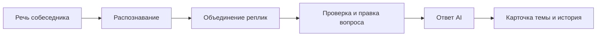

# Cheating Daddy

**AI-ассистент для технических разговоров, собеседований и подготовки к ним.**

Приложение собирает вопросы из речи, помогает разбирать код и схемы, учитывает материалы вакансии и сохраняет ответы для повторения.

Это расширенный форк [sohzm/cheating-daddy](https://github.com/sohzm/cheating-daddy).

[Главные возможности](#главные-возможности) · [Быстрый старт](#быстрый-старт) · [Проверка перед звонком](docs/INTERVIEW_CHECKLIST_RU.md)

## Главные возможности

### 1. Ответы, которые можно спокойно дочитать

Новые ответы сохраняются в отдельных карточках и не переключают выбранный ответ. Прокрутка не сбрасывается при поступлении новых фрагментов.

- **A− / A+** меняют размер текста прямо во время сессии. Размер сохраняется, для изменения можно назначить горячие клавиши.
- **Пауза** останавливает обработку нового аудио, но оставляет доступными письменные вопросы и скриншоты.
- Ответ на письменное уточнение приходит в ту карточку, из которой его отправили, даже если вы уже перешли к другой.
- Стрелки позволяют вернуться к предыдущим ответам и прочитать новые в удобный момент.

Например: вы читаете объяснение каналов Go, а собеседник уже спрашивает про Kafka. Приложение сохраняет новый вопрос, не забирая у вас текущий ответ.

### 2. Вопросы из разговора с проверкой перед отправкой

Связанные реплики объединяются в редактируемый вопрос:

> «Расскажи про индексы…»
>
> «…и почему PostgreSQL иногда их не использует?»

Короткие подтверждения вроде «угу» и «понятно» отфильтровываются. Во вкладке **«Вопросы»** можно исправить формулировку, пропустить вопрос или нажать **«Ответить на вопрос»**. Генерация ответа начинается после подтверждения.



Объединение использует временное окно и признаки темы. Если автоматика ошиблась, вопрос и его направление можно поправить вручную.

### 3. Короткий ответ сверху, подробности по запросу

Режим **«Ответ в 3 уровня»** задаёт модели структуру: краткая суть, объяснение и углублённый разбор с примером. Подробности можно раскрывать по мере необходимости.

Для продолжения разговора есть быстрые запросы:

| Действие         | Для чего                         |
| ---------------- | -------------------------------- |
| **Короче**       | Сжать ответ до главного          |
| **Пример на Go** | Перейти от объяснения к примеру  |
| **Почему?**      | Разобрать причину или механизм   |
| **Сравнить**     | Попросить сопоставление подходов |

Кнопка **✎** рядом с быстрыми действиями открывает редактор: название кнопки и запрос редактируются отдельно. Действия можно добавлять и удалять, изменения сохраняются между запусками приложения.

Код отображается с подсветкой синтаксиса, Markdown-таблицы — со структурой строк и столбцов. Широкую таблицу можно прокручивать горизонтально.

### 4. Уточнения внутри одной темы

«А если канал закрыт?» может продолжить карточку про каналы, а вопрос про Kafka — создать новую тему. В **«Настройках ответа»** доступны автоматическое определение темы, текущая тема и новая тема.

В разделе **«Темы»** можно:

- открыть независимую карточку через **«+ Новая тема»**;
- переключаться между темами;
- объединить темы или отделить уточнение;
- удалить ненужную тему.

Карточки находятся внутри окна приложения. Удаление темы из текущего списка не заменяет удаление сохранённой сессии в History.

### 5. Подготовка под конкретную вакансию

В **Preparation** создаются отдельные пакеты для разных вакансий. В пакет входят резюме, описание позиции, требования и реальные истории ваших проектов.

Поддерживается импорт **PDF с текстовым слоем, DOCX, TXT и Markdown**. Извлечённый текст можно проверить и отредактировать. Для сканированного документа без текста используйте распознавание скриншотов.

Приложение подбирает релевантные фрагменты материалов под вопрос. Инструкции просят модель опираться на факты из вашего опыта и обозначать пробелы, если сведений нет.

**Сохраните и выберите пакет до начала сессии:** контекст фиксируется при её запуске. Ответы модели всё равно нужно проверять — наличие материалов не исключает выдуманных фактов.

### 6. Скриншоты с вашим заданием

Вставьте изображение в поле сообщения, прикрепите файл кнопкой **«Скриншот»** или нажмите **«Снять экран»**. Затем добавьте текст задания и отправьте запрос. Само прикрепление не отправляет изображение AI.

Можно приложить несколько скриншотов к одному вопросу и выбрать способ обработки:

| Режим                  | Когда подходит                          | Что происходит                                                        |
| ---------------------- | --------------------------------------- | --------------------------------------------------------------------- |
| **Распознать текст**   | Текст задачи, код, сообщения об ошибках | В OpenRouter отдельная OCR-модель извлекает текст для основной модели |
| **Анализ изображения** | Схемы, графики, расположение элементов  | Изображения получает модель с поддержкой vision                       |

В OpenRouter для OCR используется отдельная модель, по умолчанию `google/gemini-2.5-flash-lite`. Основная модель затем работает с извлечённым текстом; распознанный текст показывается вместе с ответом. OCR доступен и в прямом режиме OpenAI. В режиме «Анализ изображения» используется выбранная Vision-модель, а если поле пустое — модель ответа. Стоимость зависит от настроек и тарифов провайдера.

**«Снять экран»** — новое название Analyze Screen. Кнопка делает снимок дисплея с окном приложения и добавляет его в черновик сообщения.

### 7. Инструменты для кода и System design

**Техническая задача** задаёт структуру ответа: что уточнить, идея, код, сложность, крайние случаи и объяснение решения. Для Go инструкции обращают внимание на блокировки, goroutine и отмену через `context`; для SQL — на смысл запроса и индексы.

**Проверка кода** позволяет вручную запускать код и тесты в Docker:

- **Go** — самодостаточный `package main`, стандартная библиотека, отдельное поле тестов.
- **Python** — код и проверки со стандартной библиотекой.
- **SQL** — выполнение в SQLite в памяти.

Контейнер работает без сети, с ограничениями памяти, CPU и времени. AI не запускает код автоматически. Успешный запуск не доказывает корректность всех случаев: например, проверка Go не включает race detector, а SQLite не проверяет особенности PostgreSQL.

**System design** хранит требования, нагрузку, API, хранилища, компоненты и принятые решения. Можно добавить новое ограничение, например multi-region, посмотреть изменения, отредактировать проект и вернуться к предыдущей версии. Приложение показывает простую схему компонентов и сохраняет до десяти предыдущих версий.

## Надёжность и работа после сессии

### Проверка готовности одной кнопкой

На Home кнопка **«Проверить готовность»** проверяет:

- доступ к выбранной модели и время реального ответа;
- захват экрана;
- поступление системного звука на macOS;
- сигнал микрофона, если он выбран в настройках.

Результат показывает конкретную проблему, например отсутствие аудиосигнала. Для проверки звука включите воспроизведение речи; при проверке микрофона произнесите фразу. Тишина сама по себе не означает неисправность.

Снимок и аудио этой проверки не уходят провайдеру. Короткий текстовый запрос к модели оплачивается как обычный API-запрос. Проверка отражает состояние на момент запуска.

### Скорость на своём запросе

Перед сессией в режиме OpenAI/OpenRouter нажмите **«Проверить скорость»**. Введите запрос или запишите голосом, затем нажмите **«Проверить»**. Голос сначала проходит через выбранную STT-модель. Ответ использует выбранный профиль, дополнительные инструкции и активный пакет подготовки, как новая сессия. Кнопка «Изображение +» добавляет до четырёх картинок. Только при наличии картинок дополнительно проверяются распознавание текста и анализ изображения с вашим запросом. Результаты показывают время полного ответа, имя модели и текст ответа либо ошибку. Проверку можно отменить. Это реальные платные API-запросы, а не прогноз задержки будущей сессии.

### Восстановление после сбоя

В режимах OpenAI/OpenRouter приложение сохраняет темы, черновик сообщения, вложения и положение чтения. После перезапуска Home предлагает **продолжить незавершённую сессию** или начать заново.

При сетевой ошибке можно повторить конкретный запрос в прежней карточке. Приложение не отправляет незавершённые запросы повторно без вашего действия.

Сохранение происходит раз в секунду и при обычном закрытии. При внезапном сбое последние изменения могут не успеть записаться. Повтор оборванного запроса может оплачиваться заново, если провайдер уже обработал первую отправку.

### History и план повторения

В **History** остаются вопросы и ответы сессий. Можно удалить одну историю или все сохранённые истории с подтверждением.

После завершения сессии локальный разбор предлагает:

- темы, по которым были повторные вопросы и уточнения;
- ответы, которые стоит перепроверить;
- упражнения и темы для повторения завтра.

Разбор использует правила и сохранённую историю. Он не оценивает ваши устные ответы и не подтверждает правильность подсказок AI.

## Настройка под себя

### AI Customization

Здесь два отдельных вида настроек:

| Настройка                     | Назначение                                                                                   |
| ----------------------------- | -------------------------------------------------------------------------------------------- |
| **Профиль**                   | Полные инструкции для поведения AI: роль, стиль, формат и правила ответа                     |
| **Дополнительные инструкции** | Ваши уточнения поверх выбранного профиля, например отвечать кратко и приводить примеры на Go |

Профили и наборы инструкций можно создавать, просматривать целиком, редактировать и удалять. Кнопка **«Сохранить и использовать»** сохраняет изменения и выбирает набор для следующей сессии. Уже запущенная сессия сохраняет прежние инструкции.

При первой настройке доступны шесть редактируемых профилей: **Job Interview, Sales Call, Business Meeting, Presentation, Negotiation и Exam Assistant**. Можно заменить их своими или удалить все профили и оставить только дополнительные инструкции.

### Небольшие удобства

- Настраиваемые горячие клавиши, в том числе для размера шрифта и режима «Только ответ».
- Выбор языка распознавания речи в **Settings → Speech Language**.
- Захват системного звука, микрофона или обоих источников.
- Сохранение размера окна, темы оформления, прозрачности и размера текста.
- Окно поверх других приложений, скрытие окна и режим пропуска кликов.
- Сворачивание панели инструментов стрелкой.
- Очистка поля ввода сразу после отправки. При ошибке запрос возвращается в пустое поле, не затирая новый черновик.
- Встроенная справка **Help** с описанием функций и сочетаний клавиш.

## Быстрый старт

### Что понадобится

- Node.js и npm для запуска из исходников либо готовая сборка приложения.
- Ключ выбранного AI-провайдера и доступ к нужной модели.
- Для облачных режимов — подключение к интернету.
- Разрешения на захват экрана и нужного источника звука.
- Docker — только если планируете запускать код и тесты.

Основные изменения этого форка проверялись на macOS. В проекте есть код и сборочные настройки для Windows и Linux, но это не означает одинаковую поддержку всех функций. В частности, проверка системного звука перед сессией реализована для macOS.

### Запуск из исходников

В каталоге проекта выполните:

```sh
npm install
npm start
```

Если у вас уже установлена macOS-сборка, откройте **Cheating Daddy.app** из Applications. Для проверки разрешений и сохранения настроек используйте одну и ту же копию приложения.

### Первая сессия

1. На **Home** выберите **OpenRouter · OpenAI models** или **OpenAI**, введите ключ и модель.
2. В **Settings** выберите источник звука и язык распознавания. Для речи собеседника через программу звонка нужен системный звук, а не только микрофон.
3. При необходимости заполните **Preparation** и выберите инструкции в **AI Customization**.
4. Нажмите **«Проверить готовность»**, затем **Start Session**.
5. Отправьте простой текстовый вопрос, например «Чем buffered channel отличается от unbuffered в Go?».
6. Проверьте вопрос из аудио, поставьте сессию на паузу и отправьте письменное уточнение.
7. Завершите сессию стрелкой назад и откройте её в **History**.

Перед важным разговором пройдите [подробный чек-лист](docs/INTERVIEW_CHECKLIST_RU.md) в той же программе звонка и с теми же наушниками.

## Экран и звук на macOS

Разрешения находятся в **System Settings → Privacy & Security**:

- **Screen & System Audio Recording** — для захвата экрана и системного звука.
- **Microphone** — если выбран микрофон или оба источника.

После изменения разрешений полностью закройте приложение через `Cmd + Q` и откройте снова. Разрешение должно относиться именно к запускаемой копии приложения: dev-запуск Electron и установленная сборка могут иметь разные записи в настройках macOS.

Пауза прекращает обработку нового аудио, но не завершает захват и не обязана убирать системный индикатор записи. Чтобы остановить захват, завершите сессию.

При захвате обоих источников используются отдельные аудиобуферы. Это не распознавание личности говорящего и не эхоподавление; для такого режима удобнее наушники.

## Запуск кода в Docker

Запустите Docker и заранее загрузите образы:

```sh
docker pull golang:1.25-alpine
docker pull python:3.13-alpine
```

В сессии откройте **Инструменты → Проверка кода → Проверить Docker**. Вставьте код и тесты, затем запустите проверку вручную.

Ограничения контейнера: **512 МБ памяти, 1 CPU, 96 процессов и 45 секунд**, сеть отключена. Внешние зависимости Go не скачиваются. SQL выполняется в SQLite в памяти. Если Docker недоступен, приложение не запускает код на компьютере вместо контейнера.

## Где хранятся данные

Настройки и история находятся вне репозитория:

| Платформа | Каталог                                               |
| --------- | ----------------------------------------------------- |
| macOS     | `~/Library/Application Support/cheating-daddy-config` |
| Windows   | `~/AppData/Roaming/cheating-daddy-config`             |
| Linux     | `~/.config/cheating-daddy-config`                     |

В этом каталоге хранятся:

- `credentials.json` — API-ключи в локальном JSON-файле, без шифрования средствами Keychain;
- `preferences.json`, `config.json`, `keybinds.json` — настройки, профили и сочетания клавиш;
- `interview-workspace.json` — извлечённый текст материалов подготовки и проект System design;
- `history/` — сохранённые сессии;
- `active-session.json` — состояние незавершённой сессии, включая черновики вложений, для восстановления.

Облачные режимы отправляют выбранному провайдеру аудио для распознавания, текст запроса и контекст, а также изображения при их обработке. Локальное хранение истории не означает локальную обработку AI.

Удаление историй в **History** не удаляет ключи, профили и материалы подготовки. Файл восстановления удаляется при завершении сессии или выборе начала заново.

## Если что-то не работает

| Симптом                              | Что проверить                                                                                       |
| ------------------------------------ | --------------------------------------------------------------------------------------------------- |
| Модель не отвечает                   | Провайдер, ключ, идентификатор модели, баланс и текст ошибки. Запустите проверку готовности         |
| Системный звук не поступает          | Воспроизводится ли речь, выбран ли нужный аудиорежим, выданы ли разрешения текущей копии приложения |
| Снимок экрана не получается          | Разрешение на запись экрана. После его изменения полностью перезапустите приложение                 |
| Разговор распознаётся, но ответа нет | Вопрос ждёт подтверждения во вкладке «Вопросы». Также проверьте паузу и ошибки API                  |
| Новые инструкции не применились      | Нажмите «Сохранить и использовать» и начните новую сессию                                           |
| OCR потерял связи на схеме           | Используйте «Анализ изображения» с моделью, поддерживающей vision                                   |
| Кнопки перестали принимать клики     | Проверьте, не включён ли режим пропуска кликов через окно                                           |
| Проверка кода не запускается         | Запущен ли Docker и загружены ли нужные образы                                                      |

## Разработка и сборка

Текущий интерфейс написан на **JavaScript и Lit**, приложение использует **Electron**, сборку выполняет **Electron Forge**. Планы перехода на React/TypeScript не означают, что текущая версия уже использует этот стек.

```sh
npm test         # автоматические тесты Node.js
npm run package  # упакованное приложение в out/
npm run make     # установочные артефакты для настроенной платформы
```

Настоящий линтер пока не настроен: `npm run lint` выводит сообщение-заглушку. Скрипта `typecheck` нет. Автотесты проверяют, в частности, потоки ответов, очереди, паузу, сохранение позиции чтения, восстановление и IPC. Они не заменяют проверку звука, разрешений и API в реальном звонке.

Правила работы с проектом — в [AGENTS.md](AGENTS.md), сценарии ручной проверки и технические ограничения — в [чек-листе](docs/INTERVIEW_CHECKLIST_RU.md).

## Основа проекта и лицензия

Форк основан на [Cheating Daddy](https://github.com/sohzm/cheating-daddy). Лицензия — [GPL-3.0](LICENSE).
